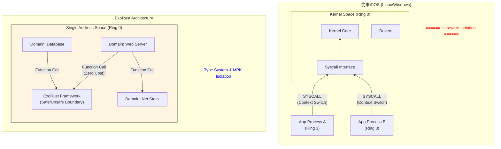
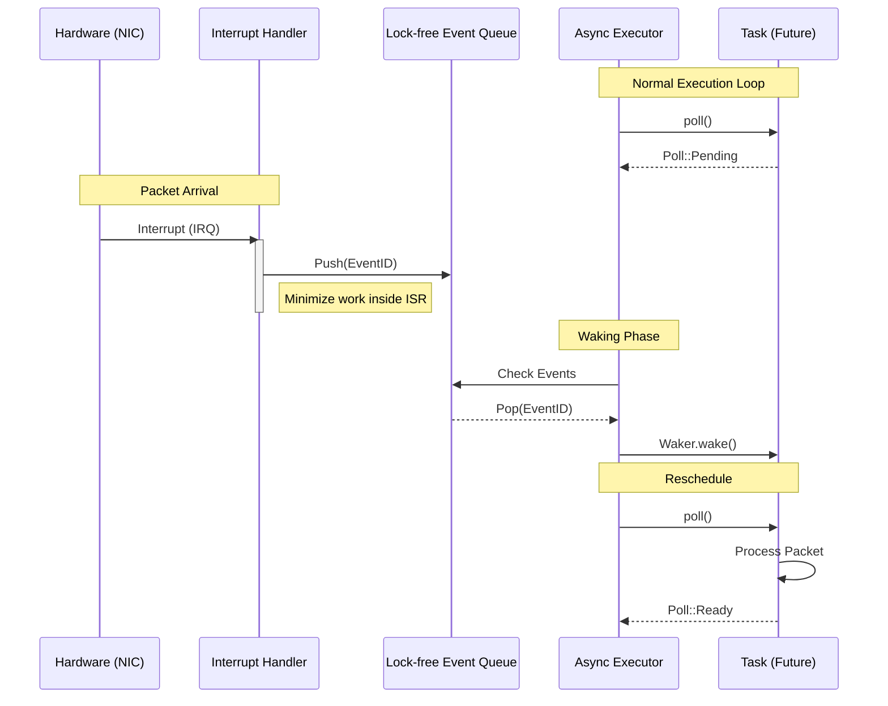
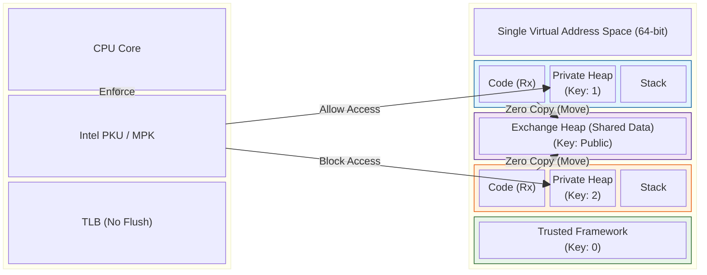

# **ExoRust**

**ExoRust** は、Linux/POSIX互換性を完全に排除し、Rustの所有権モデルと型システムをOS設計の根幹に据えた、次世代x86_64用高性能Exokernel研究プロジェクトです。

## **🎯 アーキテクチャ概論**

**ドキュメント:** [`docs/network-zero-copy.md`](docs/network-zero-copy.md) — ゼロコピーネットワーク API の設計と利用方法。  

ExoRustは、ハードウェアによる強制的な隔離（MMU/Ring分離）に伴うコンテキストスイッチやシステムコールのオーバーヘッドを排除し、**「言語内分離 (Intralingual Isolation)」**による極限の効率を追求します。



## **🛠 設計理念：レガシーからの脱却**

### **1. 単一アドレス空間 (Single Address Space: SAS)**

* **TLB効率の最大化:** 全てのセル（ドメイン）が同一の仮想アドレス空間を共有。CR3レジスタの書き換えを排除し、TLBフラッシュをゼロに抑えます。
* **真のゼロコピー:** アドレス変換やシリアライゼーションなしに、ポインタを渡すだけでデータの所有権を移動（Move）可能です。

### **2. 単一特権レベル (Single Privilege Level: SPL)**

* **ゼロコスト・システムコール:** 全てのコードをRing 0で実行。システムコールは通常の関数呼び出し（Function Call）へと置換され、モードスイッチのコストを消滅させます。
* **型システムによる安全性:** コンパイラがビルド時にメモリ安全性を証明。不正なメモリアクセスは実行時ではなくコンパイル時に阻止されます。

### **3. Async-First & Fuel-based Scheduling**

* **協調的マルチタスク:** Rustの`async/await`を用いたスタックレスコルーチンにより、数万のタスクを最小限のメモリフットプリントで管理します。
* **スターベーション対策:** ループや関数呼び出しに「燃料（Fuel）」消費コードを自動挿入。CPU独占を防止しつつ、プリエンプションの利点を維持します。



## **🛡 セキュリティモデル (MPK & Isolation)**

単一アドレス空間における脆弱性（Spectre等）への対策として、**Intel MPK (Memory Protection Keys)** を第一級市民として統合しています。

* **ハードウェア支援型分離:** ページテーブルの保護キー(PKU)を使用し、約20サイクルでドメイン間のアクセス権を動的に切り替えます。
* **多層防御:** Rustの型システムによる論理的分離と、MPKによる物理的分離を組み合わせ、投機的実行攻撃に対する堅牢な防御壁を構築します。



## **📊 パフォーマンス目標**

| 操作 | 従来OS (Linux等) | **ExoRust (目標値)** | 改善率 |
| --- | --- | --- | --- |
| システムコール遅延 | ~200-500 ns | **< 100 ns** | 2-5x |
| コンテキストスイッチ | ~1000-3000 ns | **< 500 ns** | 2-6x |
| 通信コスト | データコピー発生 | **完全ゼロコピー** | - |
| ネットワーク (10GbE) | 割り込みによる飽和 | **ポーリングによるフルレート** | - |

## **📁 プロジェクト構造**

```
src/
├── abi/               # 型定義ハッシュによるABI互換性検証
├── allocator.rs       # グローバルアロケータ
├── bootstrap/         # 1GB Huge Pageによる初期マッピング
├── debug/             # バックトレース, プロファイラ, GDBスタブ
├── domain/            # ドメイン管理とセルローダー
├── io/                # I/Oサブシステム
│   ├── nvme.rs        # NVMeポーリングドライバ
│   ├── polling.rs     # 適応的ポーリングロジック
│   └── virtio.rs      # VirtIOドライバ
├── live_update/       # Epochベースのライブアップデート・Quiescent State
├── mm/                # メモリ管理
│   ├── exchange_heap.rs # ドメイン間共有ヒープ (Exchange Heap)
│   └── numa.rs        # NUMAトポロジ検出と最適化
├── net/               # smoltcp統合ネットワークスタック
├── task/              # Canonical per-core executor と task runtime
├── security/          # MPKドメイン遷移, Spectre緩和策, 署名検証
└── main.rs            # カーネルエントリポイント

```

## **🚀 クイックスタート**

### **必要条件**

* Rust nightly (2026年以降推奨)
* `rust-src`, `llvm-tools-preview`
* QEMU (x86_64)

### **ビルド & 実行**

```bash
# 1. ツールチェーンの準備
rustup install nightly
rustup component add rust-src llvm-tools-preview

# 2. カーネルのビルド
cargo build --target x86_64-exorust.json

# 3. QEMUで実行 (UEFIモード推奨)
./scripts/run.sh --uefi

# 4. テスト実行（純 / host, デフォルト）
cargo test

# kernel 純ロジックテストは stock `#[test]` ハーネス
cargo test -p rany_kernel -- --list
cargo test -p rany_kernel security::capability::tests::test_capability_set -- --exact --nocapture

# 5. 任意: 純テストの required tier（中央TOML経由）
python3 scripts/verify_pure_tier_map.py
python3 scripts/run_pure_tier.py --tier pr-required

# 6. 任意: QEMU実 (full-boot, exoloader -> 実kernel)
cargo test -p qemu-tests fullboot_pr_required -- --exact --nocapture

# 6-1. 任意: network プロファイルのみ実行
QEMU_TEST_PROFILE_ONLY=network cargo test -p qemu-tests fullboot_pr_required -- --exact --nocapture

# 7. 任意: 夜間拡張 tier（ローカルで明示実行）
python3 scripts/run_pure_tier.py --tier nightly-required --include-ignored
cargo test -p qemu-tests fullboot_nightly_required -- --ignored --exact --nocapture

```

テスト構成は 2 層です。

* `純` (crate-local host `#[test]`): 高速ロジック検証。`cargo test`（root）は workspace default-members の pure tier を実行し、`rany_kernel` もここに含まれます。
* `QEMU実` (`qemu-tests`): `exoloader -> 実kernel ELF` の full-boot 検証。`run_integration=<profile>` を `exoloader.cmdline` に注入して runtime dispatcher を起動します。

補足:

* pure tier (`pr-required` / `nightly-required`) の真実源は `tests/pure_tiers.toml` です。
* `pure-tests` は削除済み。純テストは crate-local host `#[test]` に集約されています。
* `rany_kernel` は hybrid crate として pure host test と full-boot QEMU test の両方に参加します。
* kernel 純テストは stock harness なので `--list` と `--exact` がそのまま使えます。
* `pending` / `runtime_pending` スイートは廃止されました。
* 旧 `qemu-suites/*` からの移行棚卸しは `tests/migration_case_map.toml` を参照してください。
* `qemu-tests` 実行時のログは `target/qemu-logs/` に出力されます（serial / QEMU stderr）。
* `fullboot_pr_required` の対象プロファイルは `boot-smoke`, `storage`, `driver_domain`, `iommu`, `network` です。
* IOMMU residual canonical: `none`
* 旧 `iommu_wave2_*` residual alias は削除済み。IOMMU の full-boot 検証は `iommu` profile と canonical な `test_iommu()` / `crate::io::iommu::qemu_tests::*` 導線に集約されています。
* IOMMU wave3 residual monitored smoke（required 未投入）: `none`
* AMD-Vi Wave0 required 実行対象（6件）: `alias_devids_for_device_dedup`, `alias_devids_for_device_no_match`, `ivhd_flags_for_device_combined`, `ivhd_flags_for_device_acpi_hid`, `map_ivmd_ranges_exclusion_splits`, `map_for_device_rejects_exclusion_range`
* AMD-Vi Wave1 required 実行対象（5件）: `cmdqueue_map_unmap_with_domain`, `map_device_nonblocking`, `dma_mask_respects_32bit_limit`, `security_notifier_dispatch`, `cmdqueue_pressure`
* AMD-Vi Wave5 required 実行対象（6件 — IRT）: `irt_entry_construction`, `irt_alloc_free`, `irt_exhaustion`, `irt_invalidation_cmd_format`, `map_interrupt_returns_handle`, `get_remap_msi_message_format`
* Graphics/Framebuffer Wave6 Phase A required 実行対象（24件）: `draw_image_32bit_bgra_backbuffer`, `draw_image_24bit_bgr_backbuffer`, `write_bgr_run_small_mmio`, `write_bgr_run_large_mmio_full`, `write_bgr_run_large_mmio_full_unaligned`, `write_bgr_run_small_mmio_pairs_aligned`, `write_bgr_run_small_mmio_generic_unaligned`, `draw_hline_32bit_backbuffer`, `draw_text_space_32bit_backbuffer`, `draw_line_matches_naive_32bit_backbuffer`, `draw_line_matches_naive_24bit_backbuffer`, `draw_text_space_24bit_backbuffer`, `draw_image_32bit_mmio`, `draw_image_24bit_mmio`, `draw_image_32bit_mmio_rgba`, `write_bytes_mmio_alignment`, `write_opaque_run_24bit_even_odd_mmio`, `pack_rgba_to_bgra_basic`, `pack_rgba_to_bgra_scalar_random`, `draw_image_bgra_stream_matches_backbuffer`, `fill_rect_32bit_mmio`, `dirty_rect_tracking`, `dirty_rect_flush_only_marked_area`, `draw_text_partial_left_clip_32bit_backbuffer`
* Graphics/Framebuffer Wave6 Phase B required 実行対象（12件）: `write_bgr_run_large_mmio`, `write_bgr_run_large`, `draw_image_24bit_rgb888_backbuffer`, `draw_hline_24bit_rgb888_mmio`, `pack_rgba_to_bgra_ssse3_matches_scalar`, `pack_rgba_to_bgra_avx2_matches_scalar`, `pack_rgba_to_bgr24_avx2_matches_scalar`, `pack_rgba_to_bgr24_ssse3_matches_scalar`, `pack_rgba_to_bgra_neon_matches_scalar`, `pack_rgba_to_bgr24_neon_matches_scalar`, `pack_rgba_to_bgr24_neon_matches_scalar_rgb`, `packer_env_override_no_std`（ターゲット未対応SIMDは deterministic skip）

* Graphics/Framebuffer Wave6 bench required 実行対象（5件）: `bench_draw_image_bulk`, `bench_draw_image_24bit_bulk`, `bench_draw_image_rgba_bulk`, `bench_draw_hline_bulk`, `bench_draw_text_bulk`（QEMU required では性能比較ではなく deterministic functional smoke として検証）
* MM Wave7 async_swapout required 実行対象（9件）: `buffer_pool_4k_basic`, `buffer_pool_2m_basic`, `memcg_concurrent_swapout_canonical`, `async_swapout_concurrent_dedup_canonical`, `async_swapout_stress_concurrency_canonical`, `async_swapout_heavy_stress_canonical`, `bench_enqueue_pool_effect`, `bench_buffer_pool_2m_reuse`, `bench_buffer_pool_1g_reuse`（bench は性能比較ではなく deterministic functional smoke）
* MM Wave7 required strict policy: allocation不足は required failure 扱い（OOM-pass fallback を許容しない）
* MM Wave7 page_reclaim required 実行対象（8件）: `watermarks_calculation`, `pressure_level`, `mglru_list_add`, `blocked_unsafe_requeues_victim`, `blocked_unsafe_requeues_anonymous_dirty_victim`, `file_backed_clean_reclaims_with_unsafe_disabled`, `async_success_clears_pending_and_accounts_success`, `async_failure_requeues_and_clears_pending`
* Graphics/Framebuffer Wave6 residual: `none`（bench系5件は required で deterministic functional smoke 化済み）
* MM Wave7 residual（監視）: `none`。
* NET endpoint required 実行対象（68件）: congestion(core/cubic/bbr/variant) + flow_control + futures + handler + inner + retransmit + segment + socket + tcb + core(tests.rs) + types + window_scale。
* NET endpoint residual（監視）: `none`。
* NET core stack required 実行対象（90件）: L2-L4中心（adaptive_polling, mempool, zero_copy, ethernet, arp, icmp, udp, ipv4, icmpv6, stack, ipv6, ndp, tcp）。
* NET core stack residual（監視）: `none`。
* NET peripheral required 実行対象（67件）: dhcp(v4+v6) + dns + mdns + igmp + driver_bridge。
* NET peripheral residual（監視）: `none`。
* Storage/FS required 実行対象（59件）: async_ops + async_memfs + cache(core+block) + devfs + ext2 + fs_abstraction + memfs + page + page_cluster_buffer + kernel_fs（legacy compatibility layer なし）。
* Storage/FS residual（監視）: `none`。
* 運用fallback: wave3の `detach/attach` 系で揺らぎが出た場合は当該2件のみ required から外し、residual 監視へ戻す（pasid_table 3件は required 維持）。
* IOMMU Wave5 canonical 5件運用は fix-forward 方針を維持（不安定時も即 rollback せず、required 上で安定化修正）。

## **📄 ライセンス**

MIT License - 詳細は [LICENSE](https://www.google.com/search?q=LICENSE) を参照

## **📚 参考資料**

* [RedLeaf: Isolation and Communication in a Safe Operating System](https://www.usenix.org/conference/osdi20/presentation/narayanan-vikram)
* [Theseus: an Experiment in Operating System Structure](https://www.usenix.org/conference/osdi20/presentation/boos)
* [Asterinas: The Framekernel Architecture](https://asterinas.github.io/)

---

**ExoRust** - Rustの力でオペレーティングシステムを再定義 🦀
