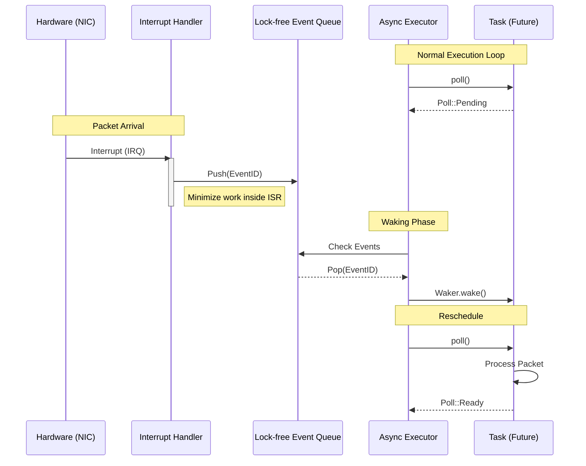

# **ExoRust**

**ExoRust** は、Linux/POSIX互換性を完全に排除し、Rustの所有権モデルと型システムをOS設計の根幹に据えた、次世代x86_64用高性能Exokernel研究プロジェクトです。

## **🎯 アーキテクチャ概論**

**ドキュメント:** [`docs/network-zero-copy.md`](docs/network-zero-copy.md) — ゼロコピーネットワーク API の設計と利用方法。

ExoRustは、ハードウェアによる強制的な隔離（MMU/Ring分離）に伴うコンテキストスイッチやシステムコールのオーバーヘッドを排除し、**「言語内分離 (Intralingual Isolation)」**による極限の効率を追求します。

```mermaid
graph TD
    subgraph Legacy ["従来のOS (Linux/Windows)"]
        direction BT
        App1[App Process A<br/>(Ring 3)]
        App2[App Process B<br/>(Ring 3)]
        
        subgraph Kernel ["Kernel Space (Ring 0)"]
            SyscallHandler[Syscall Interface]
            KCore[Kernel Core]
            Drivers[Drivers]
        end

        %% Separator
        Boundary1[====== Hardware Isolation ======]
        style Boundary1 fill:none,stroke:none,color:red

        App1 -- "SYSCALL<br/>(Context Switch)" --> SyscallHandler
        App2 -- "SYSCALL<br/>(Context Switch)" --> SyscallHandler
        SyscallHandler --> KCore
    end

    subgraph ExoRust ["ExoRust Architecture"]
        direction BT
        
        subgraph SAS ["Single Address Space (Ring 0)"]
            style SAS fill:#f9f,stroke:#333,stroke-width:2px,fill-opacity:0.1
            
            ExoApp1[Domain: Web Server]
            ExoApp2[Domain: Database]
            ExoNet[Domain: Net Stack]
            
            Framework[ExoRust Framework<br/>(Safe/Unsafe Boundary)]
            
            %% Direct Function Calls
            ExoApp1 -- "Function Call<br/>(Zero Cost)" --> Framework
            ExoApp1 -- "Function Call" --> ExoNet
            ExoApp2 -- "Function Call" --> Framework
        end
        
        %% Protection
        Safety[Type System & MPK Isolation]
        style Safety fill:none,stroke:none,color:blue
    end

```

## **🛠 設計理念：レガシーからの脱却**

### **1. 単一アドレス空間 (Single Address Space: SAS)**

* **TLB効率の最大化:** 全てのセル（ドメイン）が同一の仮想アドレス空間を共有。CR3レジスタの書き換えを排除し、TLBフラッシュをゼロに抑えます。
* **真のゼロコピー:** アドレス変換やシリアライゼーションなしに、ポインタを渡すだけでデータの所有権を移動（Move）可能です。

### **2. 単一特権レベル (Single Privilege Level: SPL)**

* **ゼロコスト・システムコール:** 全てのコードをRing 0で実行。システムコールは通常の関数呼び出し（Function Call）へと置換され、モードスイッチのコストを消滅させます。
* **型システムによる安全性:** コンパイラがビルド時にメモリ安全性を証明。不正なメモリアクセスは実行時ではなくコンパイル時に阻止されます。

### **3. Async-First & Fuel-based Scheduling**

* **協調的マルチタスク:** Rustの`async/await`を用いたスタックレスコルーチンにより、数万のタスクを最小限のメモリフットプリントで管理します。
* **スターベーション対策:** ループや関数呼び出しに「燃料（Fuel）」消費コードを自動挿入。CPU独占を防止しつつ、プリエンプションの利点を維持します。



## **🛡 セキュリティモデル (MPK & Isolation)**

単一アドレス空間における脆弱性（Spectre等）への対策として、**Intel MPK (Memory Protection Keys)** を第一級市民として統合しています。

* **ハードウェア支援型分離:** ページテーブルの保護キー(PKU)を使用し、約20サイクルでドメイン間のアクセス権を動的に切り替えます。
* **多層防御:** Rustの型システムによる論理的分離と、MPKによる物理的分離を組み合わせ、投機的実行攻撃に対する堅牢な防御壁を構築します。

```mermaid
block-beta
    columns 3
    
    block:Hardware
        columns 1
        CPU["CPU Core"]
        MPK["Intel PKU / MPK"]
        TLB["TLB (No Flush)"]
    end

    space

    block:MemorySpace
        columns 1
        title "Single Virtual Address Space (64-bit)"
        
        block:DomainA
            columns 3
            DA_Text["Code (Rx)"] 
            DA_Heap["Private Heap<br/>(Key: 1)"]
            DA_Stack["Stack"]
        end
        
        block:Exchange
            columns 1
            EH["Exchange Heap (Shared Data)<br/>(Key: Public)"]
        end

        block:DomainB
            columns 3
            DB_Text["Code (Rx)"]
            DB_Heap["Private Heap<br/>(Key: 2)"]
            DB_Stack["Stack"]
        end
        
        block:Framework
            columns 1
            FW["Trusted Framework<br/>(Key: 0)"]
        end
    end

    CPU -- "Enforce" --> MPK
    MPK -- "Block Access" --> DB_Heap
    MPK -- "Allow Access" --> DA_Heap
    DA_Text -- "Zero Copy (Move)" --> EH
    DB_Text -- "Zero Copy (Move)" --> EH

    style DomainA fill:#e1f5fe,stroke:#01579b
    style DomainB fill:#fff3e0,stroke:#e65100
    style Framework fill:#e8f5e9,stroke:#1b5e20
    style Exchange fill:#f3e5f5,stroke:#4a148c

```

## **📊 パフォーマンス目標**

| 操作 | 従来OS (Linux等) | **ExoRust (目標値)** | 改善率 |
| --- | --- | --- | --- |
| システムコール遅延 | ~200-500 ns | **< 100 ns** | 2-5x |
| コンテキストスイッチ | ~1000-3000 ns | **< 500 ns** | 2-6x |
| 通信コスト | データコピー発生 | **完全ゼロコピー** | - |
| ネットワーク (10GbE) | 割り込みによる飽和 | **ポーリングによるフルレート** | - |

## **📁 プロジェクト構造**

```
src/
├── abi/               # 型定義ハッシュによるABI互換性検証
├── allocator.rs       # グローバルアロケータ
├── bootstrap/         # 1GB Huge Pageによる初期マッピング
├── debug/             # バックトレース, プロファイラ, GDBスタブ
├── domain/            # ドメイン管理とセルローダー
├── io/                # I/Oサブシステム
│   ├── nvme.rs        # NVMeポーリングドライバ
│   ├── polling.rs     # 適応的ポーリングロジック
│   └── virtio.rs      # VirtIOドライバ
├── live_update/       # Epochベースのライブアップデート・Quiescent State
├── mm/                # メモリ管理
│   ├── exchange_heap.rs # ドメイン間共有ヒープ (Exchange Heap)
│   └── numa.rs        # NUMAトポロジ検出と最適化
├── net/               # smoltcp統合ネットワークスタック
├── scheduler/         # Fuel-based Executor, ワークスティーリング
├── security/          # MPKドメイン遷移, Spectre緩和策, 署名検証
└── main.rs            # カーネルエントリポイント

```

## **🚀 クイックスタート**

### **必要条件**

* Rust nightly (2025年以降推奨)
* `rust-src`, `llvm-tools-preview`
* QEMU (x86_64)

### **ビルド & 実行**

ExoRustは **Limine bootloader** (UEFI/BIOS対応) を使用します。

```bash
# 1. ツールチェーンの準備
rustup install nightly
rustup component add rust-src llvm-tools-preview

# 2. カーネルのビルド
cargo build --target x86_64-exorust.json

# 3. QEMUで実行 (UEFIモード推奨)
./scripts/run.sh --uefi

# 4. テスト実行（公式入口）
cargo test

# 5. 任意: 特定スイートのみ実行
cargo test -p qemu-tests -- --nocapture suite_core

# 6. 任意: pending スイート（移行監視・非必須）
cargo test -p qemu-tests -- --ignored --nocapture suite_pending

# 7. 任意: runtime pending スイート（非必須・runtime依存監視）
cargo test -p qemu-tests -- --ignored --nocapture suite_kernel_runtime_pending

```

`cargo test` は `qemu-tests` を入口として、`core/drivers/fs/graphics/kernel/tools` の required suites をQEMU上で実行します。`pending` / `kernel_runtime_pending` は `--ignored` 指定時のみ実行される非必須スイートです（例: `cargo test -p qemu-tests -- --ignored --nocapture suite_kernel_runtime_pending suite_pending`）。
`suite_kernel` の required IOMMU 実行範囲は `qemu-suites/kernel/src/main.rs` を真実源とし、wave2 deterministic（core + poison/QI + grouping + ats_pri + residual）に加えて wave3 deterministic（scalable: pasid0 fault resolution + detach/attach cycle, pasid_table: alloc/free + multi-domain + exhaustion, mapping_slab, zombie_queue, pri_fuel）、wave4 deterministic（AMD Wave0: alias/flags/ivmd range split/exclusion reject の6件）、wave5 deterministic（AMD Wave1 residual 5件 + AMD Wave5 IRT 6件）を実行します。`std`/global-singleton/time-pressure 依存の canonical 名は pending で監視しつつ、required の no_std smoke を並行維持する二層管理を採用します。

`pending` 運用:
- 監視項目の管理: `scripts/qemu_pending_cases.lst`
- IOMMU residual parity マッピング: `scripts/qemu_iommu_residual_parity.lst`
- 整合ガード: `bash scripts/verify_iommu_residual_parity.sh`
- AMD Wave4 required 配線ガード: `bash scripts/verify_iommu_amd_wave4_required.sh`
- AMD Wave5 required 配線ガード: `bash scripts/verify_iommu_amd_wave5_required.sh`
- Graphics/Framebuffer Wave6 required 配線ガード: `bash scripts/verify_graphics_framebuffer_wave6_required.sh`
- 実行結果サマリ: `target/qemu-logs/pending-summary.txt`, `target/qemu-logs/pending-summary.json`
- runtime依存監視サマリ: `target/qemu-logs/kernel-runtime-pending-summary.txt`, `target/qemu-logs/kernel-runtime-pending-summary.json`
- runtime pending は runtime依存2件（`kernel_net_bridge_zero_copy_integration` / `kernel_bench_framebuffer`）専用の non-blocking 監視
- `kernel-runtime-pending-summary` は `suite`, `passed_count`, `failed_count`, `blocked_count`, `suite_log_path`, `generated_at_utc` を出力
- IOMMU residual canonical pending: `test_cmdqueue_map_unmap_with_domain`, `test_map_for_device_async_and_unmap`, `test_map_for_device_respects_dma_mask`, `test_api_security_notifier_registration`, `test_qi_metrics_pressure`
- IOMMU wave3 pending monitored smoke（required 未投入）: `none`
- AMD-Vi Wave0 required 実行対象（6件）: `alias_devids_for_device_dedup`, `alias_devids_for_device_no_match`, `ivhd_flags_for_device_combined`, `ivhd_flags_for_device_acpi_hid`, `map_ivmd_ranges_exclusion_splits`, `map_for_device_rejects_exclusion_range`
- AMD-Vi Wave1 required 実行対象（5件）: `cmdqueue_map_unmap_with_domain`, `map_device_nonblocking`, `dma_mask_respects_32bit_limit`, `security_notifier_dispatch`, `cmdqueue_pressure`
- AMD-Vi Wave5 required 実行対象（6件 — IRT）: `irt_entry_construction`, `irt_alloc_free`, `irt_exhaustion`, `irt_invalidation_cmd_format`, `map_interrupt_returns_handle`, `get_remap_msi_message_format`
- Graphics/Framebuffer Wave6 Phase A required 実行対象（24件）: `draw_image_32bit_bgra_backbuffer`, `draw_image_24bit_bgr_backbuffer`, `write_bgr_run_small_mmio`, `write_bgr_run_large_mmio_full`, `write_bgr_run_large_mmio_full_unaligned`, `write_bgr_run_small_mmio_pairs_aligned`, `write_bgr_run_small_mmio_generic_unaligned`, `draw_hline_32bit_backbuffer`, `draw_text_space_32bit_backbuffer`, `draw_line_matches_naive_32bit_backbuffer`, `draw_line_matches_naive_24bit_backbuffer`, `draw_text_space_24bit_backbuffer`, `draw_image_32bit_mmio`, `draw_image_24bit_mmio`, `draw_image_32bit_mmio_rgba`, `write_bytes_mmio_alignment`, `write_opaque_run_24bit_even_odd_mmio`, `pack_rgba_to_bgra_basic`, `pack_rgba_to_bgra_scalar_random`, `draw_image_bgra_stream_matches_backbuffer`, `fill_rect_32bit_mmio`, `dirty_rect_tracking`, `dirty_rect_flush_only_marked_area`, `draw_text_partial_left_clip_32bit_backbuffer`
- Graphics/Framebuffer Wave6 Phase B required 実行対象（11件）: `write_bgr_run_large_mmio`, `write_bgr_run_large`, `draw_image_24bit_rgb888_backbuffer`, `draw_hline_24bit_rgb888_mmio`, `pack_rgba_to_bgra_ssse3_matches_scalar`, `pack_rgba_to_bgra_avx2_matches_scalar`, `pack_rgba_to_bgr24_avx2_matches_scalar`, `pack_rgba_to_bgr24_ssse3_matches_scalar`, `pack_rgba_to_bgra_neon_matches_scalar`, `pack_rgba_to_bgr24_neon_matches_scalar`, `pack_rgba_to_bgr24_neon_matches_scalar_rgb`（ターゲット未対応SIMDは deterministic skip）
- Graphics/Framebuffer Wave6 residual（pending）: bench系5件、packer env系2件
- 運用fallback: wave3の `detach/attach` 系で揺らぎが出た場合は当該2件のみ required から外し、pending 監視へ戻す（pasid_table 3件は required 維持）。
- `#[test]` 例外の技術的ガード（実装ガード）: `scripts/qemu_legacy_test_allowlist.lst`

## **📄 ライセンス**

MIT License - 詳細は [LICENSE](https://www.google.com/search?q=LICENSE) を参照

## **📚 参考資料**

* [RedLeaf: Isolation and Communication in a Safe Operating System](https://www.usenix.org/conference/osdi20/presentation/narayanan-vikram)
* [Theseus: an Experiment in Operating System Structure](https://www.usenix.org/conference/osdi20/presentation/boos)
* [Asterinas: The Framekernel Architecture](https://asterinas.github.io/)

---

**ExoRust** - Rustの力でオペレーティングシステムを再定義 🦀
